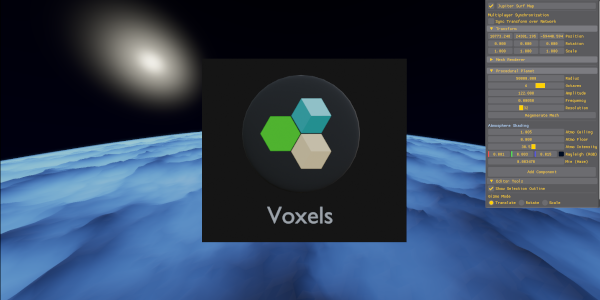
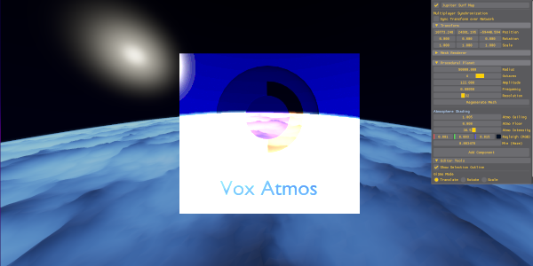

# Crescendo Engine — Voxel Systems Plugin (Feature Branch)

> **⚠️ Note on Installation & Usage:** > This is an active development branch focused on engine architecture refactoring. For stable builds, installation instructions, and general engine setup, please refer to the **[main branch](BlackOspreyDigital/CrescendoEngine/tree/main)**.

---

  

---

## Branch Objective: Voxel Decoupling & Plugin Architecture

In earlier iterations, voxel rendering and spatial volume logic were hardcoded directly into the Vulkan rendering stack (`renderingserver.cpp`). The goal of this branch is to **decouple domain-specific voxel systems from the core renderer** and transition them into a standalone plugin architecture.

### Key Architectural Goals:
* **Zero Voxel Awareness in Core Renderer:** Strip out all direct dependencies on octrees, quadtrees, and chunk-generation loops from `renderingserver.cpp`.
* **Data-Driven Draw Contracts:** The core renderer will act as a stateless execution engine, consuming generic draw packets (e.g., indirect draw buffers and resource spans) rather than traversing spatial trees directly.
* **Modular Voxel Plugin:** Move 64-bit quadtree/octree volume calculations, chunk culling, and LOD determination into an independent plugin layer that feeds cleanly into the render bridge.

---

  

---

## Voxel Atmosphere Systems
* **Rayleigh Scattering:** Physically-guided atmospheric scattering for realistic volumetric depth.
* **Light-Driven Atmosphere Math:** Dynamic lighting calculation tightly integrated with volume densities.
* **Fully Customizable:** Complete control over atmospheric parameters including color gradients, density, and layer thickness.
* **Layerable Fog Architecture:** Centralized volumetric fog managed directly within the voxel plugin, distinct from Crescendo's global fog rendering method.

## Current Status
* [x] Reset workspace to stable base (`bravo`).
* [ ] Define generic intermediate C++ draw contracts (`SurfaceDrawPacket`).
* [ ] Gut hardcoded voxel loops and includes from `renderingserver.cpp`.
* [ ] Wire up the intermediary extraction stage to feed indirect draw commands.